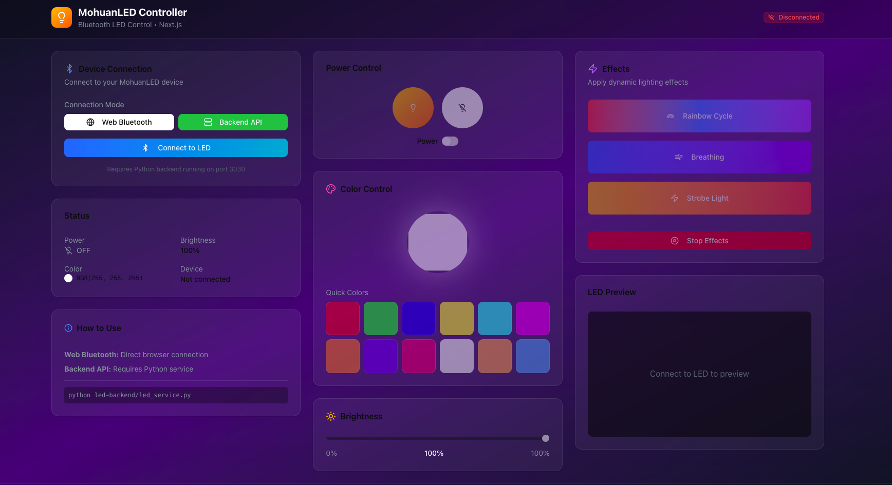
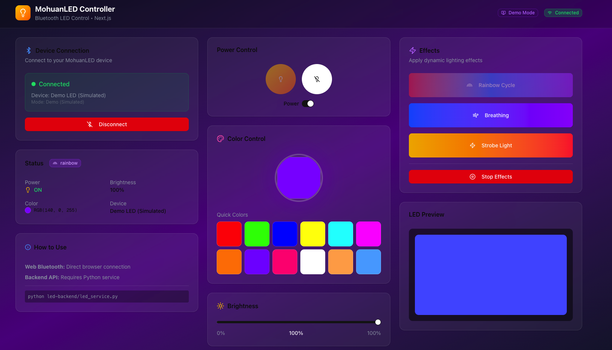

# 🌈 MohuanLED Controller

A modern Next.js web application for controlling MohuanLED Bluetooth lights. Supports **three connection modes**:

1. **Web Bluetooth API** - Direct browser-to-LED communication (Chrome, Edge, Opera)
2. **Backend API** - Via Python service for environments where Web Bluetooth is blocked
3. **Demo Mode** - Simulated mode for testing without Bluetooth hardware


## 📸 Screenshot





## ✨ Features

- 🔌 **Three Connection Modes**
  - Web Bluetooth (direct browser connection)
  - Backend API (via Python service)
  - Demo Mode (simulated for testing)
- 💡 **Power Control** - Turn lights on/off with a single click
- 🎨 **Color Picker** - Full RGB color selection with preset colors
- ☀️ **Brightness Control** - Adjustable brightness from 0-100%
- ⚡ **Dynamic Effects**
  - Rainbow Cycle
  - Breathing Effect
  - Strobe Light
- 📱 **Responsive Design** - Works on desktop and mobile
- 🎯 **LED Preview** - Real-time preview of LED state

## 🚀 Quick Start

### Prerequisites

- Node.js 18+ and Bun (or npm/yarn)
- Bluetooth adapter (built-in or USB)
- MohuanLED light device
- **For Web Bluetooth**: Chrome, Edge, or Opera
- **For Backend API**: Python 3.8+

### Installation

1. **Clone the repository**
   ```bash
   git clone https://github.com/tarikbilla/Mohuan-LED-Control-Your-Room-light.git
   cd Mohuan-LED-Control-Your-Room-light
   ```

2. **Install dependencies**
   ```bash
   bun install
   # or
   npm install
   ```

3. **Install Python dependencies** (for Backend API mode)
   ```bash
   pip install bleak fastapi uvicorn
   ```

### Running the Application

#### Option 1: Web Bluetooth Mode (Recommended for Local)

```bash
# Start Next.js development server
bun run dev
```

Then open `http://localhost:3000` in Chrome/Edge/Opera and select "Web BT" mode.

#### Option 2: Backend API Mode (For Restricted Environments)

```bash
# Terminal 1: Start Python backend
python led-backend/led_service.py

# Terminal 2: Start Next.js frontend
bun run dev
```

Then open `http://localhost:3000` and select "Backend" mode.

#### Option 3: Demo Mode (For Testing Without Hardware)

```bash
bun run dev
```

Then open `http://localhost:3000` and select "Demo" mode to test the UI without any Bluetooth hardware.

## 📁 Project Structure

```
├── led-backend/
│   ├── led_service.py        # Python Bluetooth service
│   └── requirements.txt       # Python dependencies
├── src/
│   ├── app/
│   │   ├── page.tsx          # Main UI component
│   │   ├── layout.tsx        # App layout
│   │   ├── globals.css       # Global styles
│   │   └── api/led/          # API proxy routes
│   ├── components/ui/        # shadcn/ui components
│   ├── hooks/                # Custom React hooks
│   └── lib/
│       ├── led-controller.ts # Hybrid LED controller
│       └── utils.ts          # Utility functions
├── public/
│   └── Screenshot.png        # App screenshot
├── package.json              # Dependencies
├── tailwind.config.ts        # Tailwind configuration
└── README.md                 # This file
```

## 🎮 Usage

### Web Bluetooth Mode

1. Open app in Chrome/Edge/Opera
2. Select "Web BT" mode
3. Click "Connect to LED"
4. Select your MohuanLED device from the popup
5. Control your light!

### Backend API Mode

1. Start the Python backend: `python led-backend/led_service.py`
2. Open the app in any browser
3. Select "Backend" mode
4. Click "Connect to LED"
5. The backend will auto-discover and connect to your LED

### Demo Mode

1. Open the app in any browser
2. Select "Demo" mode
3. Click "Connect to LED"
4. Test all features without real hardware!

## 🌐 Browser Support

### Web Bluetooth Mode

| Browser | Support |
|---------|---------|
| Chrome | ✅ Full support |
| Edge | ✅ Full support |
| Opera | ✅ Full support |
| Firefox | ❌ Not supported |
| Safari | ⚠️ Limited support |

### Backend API & Demo Mode

| Browser | Support |
|---------|---------|
| All browsers | ✅ Full support |

## 🔧 LED Commands

| Command | Bytes |
|---------|-------|
| Turn On | `0x69 0x96 0x02 0x01 0x01` |
| Turn Off | `0x69 0x96 0x02 0x01 0x00` |
| Set Color | `0x69 0x96 0x05 0x02 R G B` |

## 🛠️ Tech Stack

- **Framework**: Next.js 16 with App Router
- **Language**: TypeScript
- **Styling**: Tailwind CSS 4
- **UI Components**: shadcn/ui
- **Bluetooth (Web)**: Web Bluetooth API
- **Bluetooth (Backend)**: bleak (Python)
- **Backend**: FastAPI + Uvicorn

## 📝 Development

```bash
# Run development server
bun run dev

# Build for production
bun run build

# Start production server
bun run start

# Lint code
bun run lint
```

## 🐛 Troubleshooting

### Web Bluetooth Issues

**"Access to the feature 'bluetooth' is disallowed"**
- You're in an iframe or restricted environment
- Switch to "Backend" or "Demo" mode

**"No devices found"**
- Make sure your LED is powered on
- Ensure Bluetooth is enabled on your computer
- Try refreshing the page

### Backend API Issues

**"LED backend not running"**
- Start the Python service: `python led-backend/led_service.py`

**"No LED devices found" (Backend)**
- Make sure your LED is powered on
- Check if Bluetooth is enabled

**"No Bluetooth adapter found"**
- Ensure your computer has Bluetooth capability
- Enable Bluetooth in system settings

## 📜 License

This project is licensed under the MIT License - see the [LICENSE](LICENSE) file for details.

## 👨‍💻 Author

Developed by [Tarik Billa](https://github.com/tarikbilla)

## 🙏 Acknowledgments

- Original library: [Walkercito/MohuanLED-Bluetooth_LED](https://github.com/Walkercito/MohuanLED-Bluetooth_LED)
- [Web Bluetooth API](https://developer.mozilla.org/en-US/docs/Web/API/Web_Bluetooth_API)
- [bleak](https://github.com/hbldh/bleak) - Bluetooth Low Energy platform agnostic library
- [shadcn/ui](https://ui.shadcn.com/) - Beautiful UI components

---

Made with ❤️ for smart lighting enthusiasts
